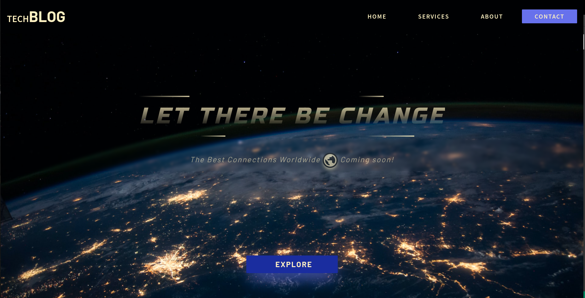
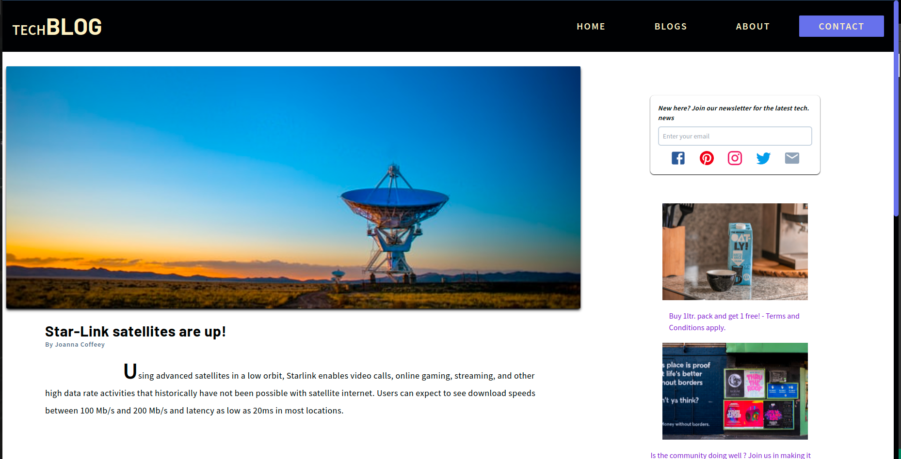

# 🌟 React-Tailwind TechnicalBlog application

Hey fellas, i've created this application that is a simple UI demo of a technical blog 👨‍💻 The app itself has been deployed on netlify on the following link:

🔗 https://darling-donut-0dfc1b.netlify.app

### Tech I've used:

- **Material-UI** for all the icons
- **React-router-DOM**  for all the dynamic routing
- **Tailwind CSS** for the theme and styling

## Dependencies

```JSON

  "dependencies": {
    "@emotion/react": "^11.8.2",
    "@emotion/styled": "^11.8.1",
    "@mui/icons-material": "^5.5.1",
    "@testing-library/jest-dom": "^5.16.2",
    "@testing-library/react": "^12.1.4",
    "@testing-library/user-event": "^13.5.0",
    "react": "^17.0.2",
    "react-arc-text": "^1.0.5",
    "react-dom": "^17.0.2",
    "react-intersection-observer": "^8.33.1",
    "react-router-dom": "^6.2.2",
    "react-scripts": "5.0.0",
    "web-vitals": "^2.1.4"
  },

```

## Dev dependencies

```JSON


  "devDependencies": {
    "@tailwindcss/line-clamp": "^0.3.1",
    "autoprefixer": "^10.4.4",
    "postcss": "^8.4.12",
    "tailwindcss": "^3.0.23"
  }

  ```

### Glimpses of the application

#### Landing page


#### Blog post



Thanks for reading :D 