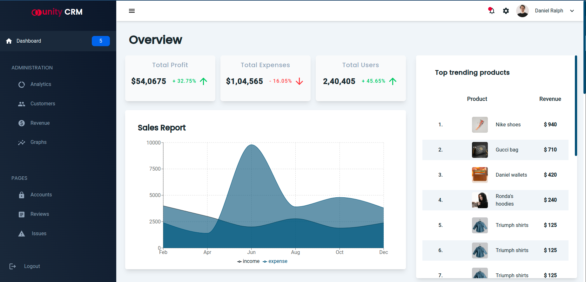
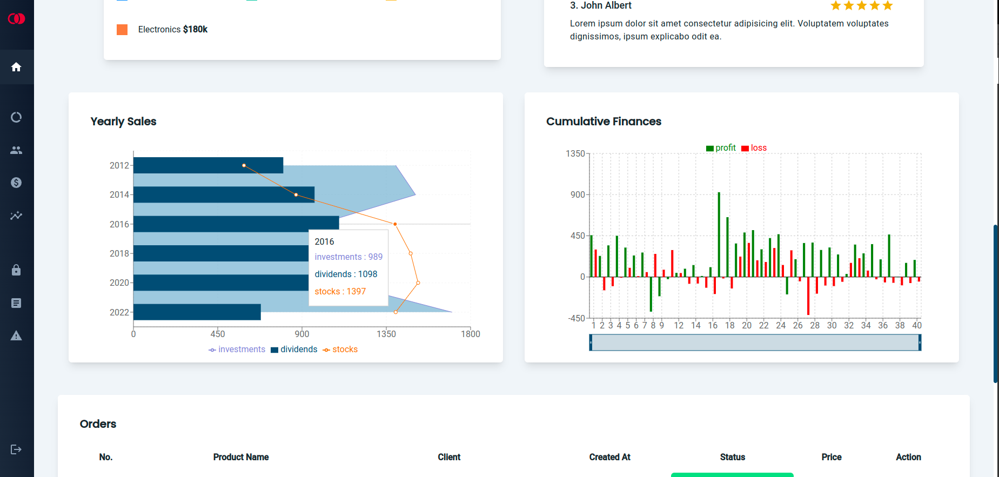
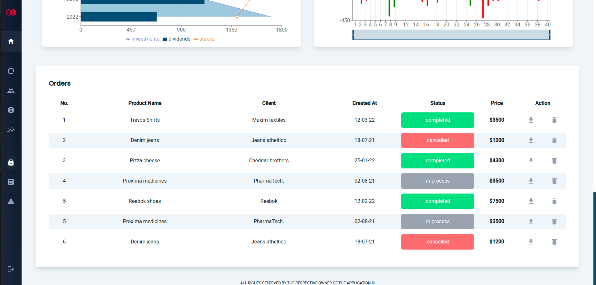

# :star2: CRM application

This is a react-tailwind Customer Relationship Management **(CRM)** app. The application is a *UI* depicting how an admin dashboard for a
e-commerce website would provide stake-holders an interface to observe the **statistics** and current **state** of the website.

#### The website can be viewed at 
 :link: [stupendous-melba-7842ae](https://stupendous-melba-7842ae.netlify.app/)

Icons for the website has been taken by [Material-UI](www.mui.com)

## :point_down: Glimpses of the application

#### 1.


#### 2.


#### 3.



### Dependencies

```JSON
"dependencies": {
    "@emotion/react": "^11.8.2",
    "@emotion/styled": "^11.8.1",
    "@mui/icons-material": "^5.5.1",
    "@testing-library/jest-dom": "^5.16.3",
    "@testing-library/react": "^12.1.4",
    "@testing-library/user-event": "^13.5.0",
    "react": "^17.0.2",
    "react-dom": "^17.0.2",
    "react-intersection-observer": "^8.33.1",
    "react-scripts": "5.0.0",
    "recharts": "^2.1.9",
    "web-vitals": "^2.1.4"
  },

"devDependencies": {
    "autoprefixer": "^10.4.4",
    "postcss": "^8.4.12",
    "tailwindcss": "^3.0.23"
  }

```

### Tailwind Configuration

```Javascript
module.exports = {
  content: [
    "./src/**/*.{js,jsx,ts,tsx}",
  ],
  theme: {
    extend: {
      colors:{
        primary:'#DA0037',
        secondary:'#1B262C',
        click:'#0F4C75',
      },
      fontFamily:{
        sans:['Roboto', 'sans-serif'],
        heading:['Poppins', 'sans-serif']
      }
    },
  },
  plugins: [],
}

```