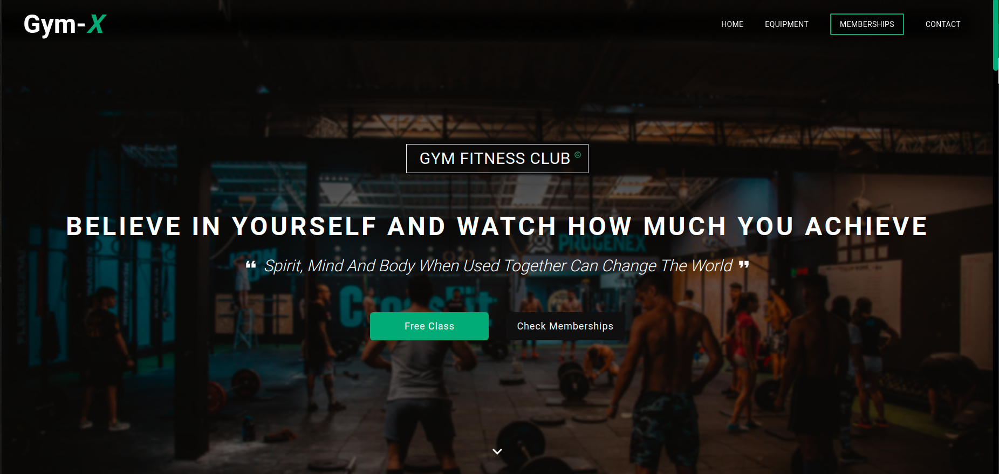
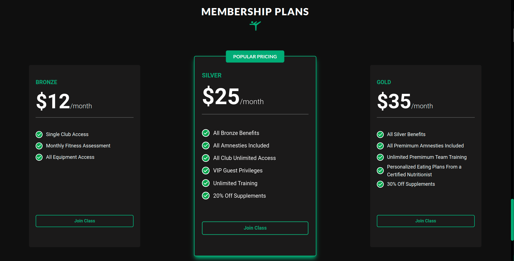
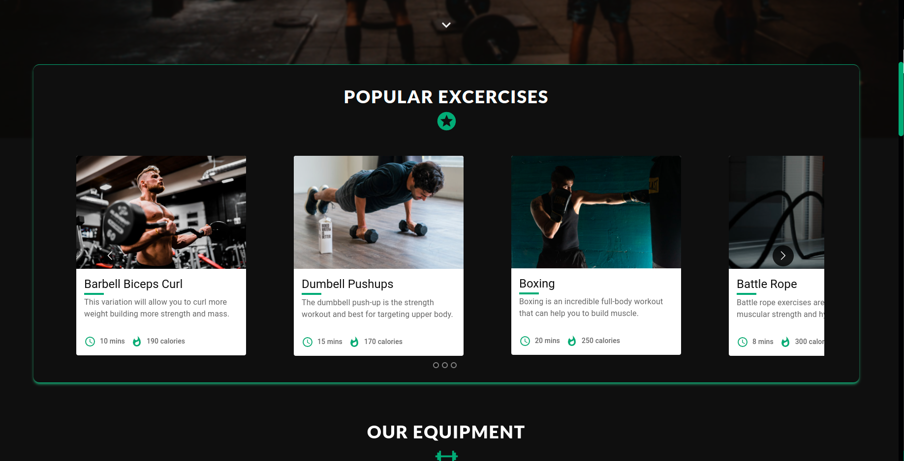

# :zap: Gym-X

Greetings everyone, Recently developed UI for a local Gym web-app  👨‍💻 The app itself has been deployed on netlify on the following link:

[](https://app.netlify.com/sites/ephemeral-lamington-586ba9/deploys)

🔗 https://ephemeral-lamington-586ba9.netlify.app

### Tech I've used:

- **MUI** for all the icons and excercise cards
- **React-Multi-Caraousel**  for a production ready caraousel
- **Tailwind CSS And MUI** for the theme and styling

## Dependencies

```JSON

  "dependencies": {
    "@emotion/react": "^11.9.0",
    "@emotion/styled": "^11.8.1",
    "@mui/material": "^5.6.3",
    "@testing-library/jest-dom": "^5.16.4",
    "@testing-library/react": "^13.1.1",
    "@testing-library/user-event": "^13.5.0",
    "react": "^18.1.0",
    "react-dom": "^18.1.0",
    "react-material-ui-carousel": "^3.3.3",
    "react-multi-carousel": "^2.8.0",
    "react-scripts": "5.0.1",
    "web-vitals": "^2.1.4"
  },
  

```

## Dev dependencies

```JSON


  "devDependencies": {
    "autoprefixer": "^10.4.4",
    "postcss": "^8.4.12",
    "tailwindcss": "^3.0.23"
  }

  ```

### Glimpses of the application

#### Landing page


#### Pricing Cards


#### Excercise Cards Caraousel



Thanks for reading :D 
